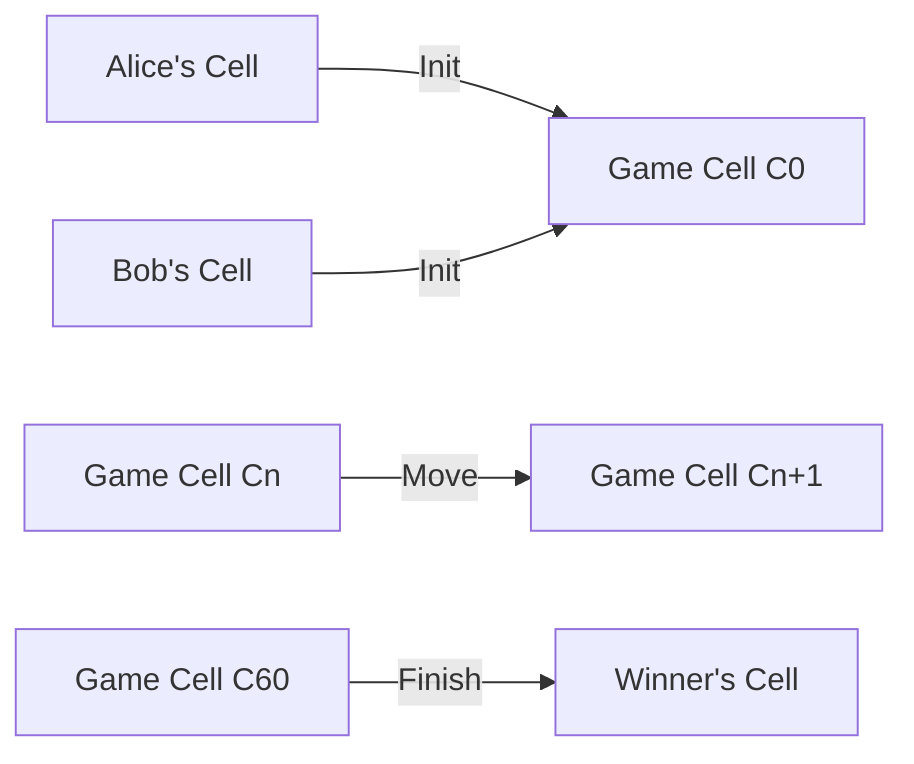

# Reversi on CKB

基于 Nervos CKB Cell 模型设计的全链上黑白翻转棋（Reversi）游戏

## 设计



1. **初始化（Init）**：游戏开始时，Alice 和 Bob 都抵押一定数额的代币，这些代币被存储在他们各自的 Cell 中，即 A 和 B。然后他们生成一个新的 Cell，C0，代表游戏的初始状态。C0 的 data 字段包含以下信息：
   - 游戏棋牌状态的 bitmap 编码（64 bytes）：这个编码代表一个 8x8 的棋盘，其中每个位代表一个格子，格子上的棋子可以是黑色、白色或空。
   - 上一回合落子的坐标 position (1 byte): 取值范围 {0..63}, 初始值 255
   - 下一回合轮到操作的玩家的序号 index（1 byte）：这个序号可以是 0 或 1，代表 Alice 或 Bob。
   - Alice 和 Bob 的公钥（各 33 bytes）：这些公钥用于验证交易的签名。

2. **落子（Move）**：在游戏过程中，玩家可以在满足 lock script 和 type script 的约束下更新 Cn 的 data 字段，生成新的 Cell Cn+1。

3. **结束（Finish）**：当游戏结束时（最多在 C60），赢家可以销毁 C60，并将抵押的代币转移到自己的 Cell D 中。

实现的关键在于其脚本：

- **lock script**：这个脚本负责验证交易的签名是否匹配 data.pubkeys[index]。这确保了只有轮到的玩家才能进行下一步操作。

- **type script**：这个脚本负责校验 data 中 bitmap, position 和 index 的更新是否符合游戏规则。这确保了玩家的每一步操作都必须符合黑白翻转棋的规则。当游戏结束时，这个脚本将跳过检查。

## 伪代码

```rust
// Lock Script Pseudo-code

fn main() -> Result<(), i8> {
    // Load current script
    let script = load_script()?;
    let args: Bytes = script.args().unpack();

    // Parse the data
    let data = parse_data(args);

    // Load the first witness
    let witness_args = load_witness_args(0, Source::Input)?;
    let signature = witness_args.lock().to_opt().ok_or(-1)?;

    // Verify the signature
    if !verify_signature(data.pubkeys[data.index], signature) {
        return Err(-2);
    }

    Ok(())
}
```

```rust
// Type Script Pseudo-code

fn main() -> Result<(), i8> {
    // Load the old data from the input cell
    let old_data = load_cell_data(0, Source::Input)?;

    // Load the new data from the output cell
    let new_data = load_cell_data(0, Source::Output)?;

    // Parse the data
    let old_game_state = parse_data(old_data);
    let new_game_state = parse_data(new_data);

    // Check the game rules
    if !check_game_rules(old_game_state, new_game_state) {
        return Err(-1);
    }

    Ok(())
}
```
